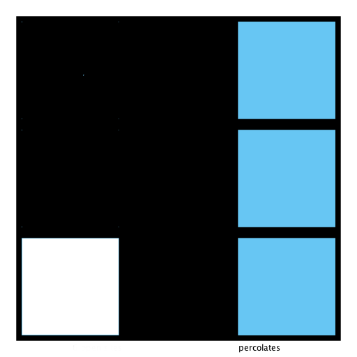
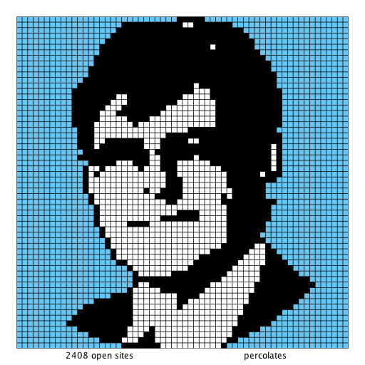

# Specification
Here is the link of assignment specification:  
http://coursera.cs.princeton.edu/algs4/assignments/percolation.html
  
# My Solution
This assignment is a connectivity problem which requires us to use `UnionFind` to sovle it.
In the course, professor give a very useful tip that we add two additional node, let's call them 'top' and 'bottom',
and union top with every node in first row, bottom with every node in last row.

Impelementation of this idea is straightforward, but there is a quention I want to mention -- Backwash  
Consider following code:
```java
// This code has bug
// twoD2OneD receives two int and give a index in UnionFind
// is site (row i, column j) full?
    public boolean isFull(int i, int j) {
        checkIndex(i, j);
        return isOpen(i, j) && uf.connected(top, twoD2OneD(i, j));
    }
```
Now there is an input like this:  


When we call `isFull(3,1)` it will give wrong answer because we have already `union(top, bottom)`.
To solve this and run within time limit, I use another `UnionFind`, connect top with first low to give answer for `isFull`.

# Last tip
Check the test provided by course, you will find some interesting inputs:  

